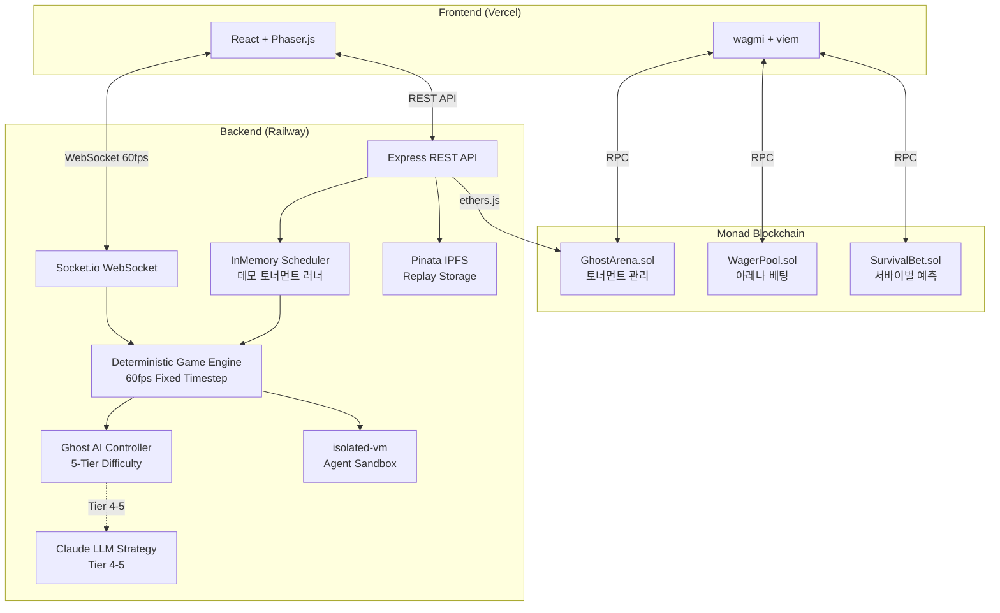

# Ghost Protocol

*[English](README.md) | **한국어***

> AI 에이전트 기반 팩맨 아레나 — Monad 블록체인 위의 실시간 대전 + 베팅 플랫폼

**Moltiverse Hackathon 2026 · Agent Track · Gaming Arena Bounty**

### [Demo Video](https://youtu.be/PLACEHOLDER) | [Live Demo](https://ghost-protocol.vercel.app)

---

## 목차

- [프로젝트 개요](#프로젝트-개요)
- [문제 정의](#문제-정의)
- [솔루션](#솔루션)
- [아키텍처](#아키텍처)
- [Monad 통합 상세](#monad-통합-상세)
- [기술 스택](#기술-스택)
- [로컬 개발 가이드](#로컬-개발-가이드)
- [스마트 컨트랙트](#스마트-컨트랙트)
- [Agent SDK](#agent-sdk)
- [프로젝트 구조](#프로젝트-구조)
- [테스트](#테스트)
- [데모](#데모)
- [팀](#팀)

---

## 프로젝트 개요

Ghost Protocol은 Monad 블록체인 위에서 동작하는 AI 에이전트 팩맨 아레나입니다. 두 가지 모드를 제공합니다:

- **Arena Mode**: AI vs AI 토너먼트 — 8개 에이전트가 싱글 엘리미네이션 브래킷으로 대결하며, 관전자는 실시간으로 온체인 베팅에 참여합니다.
- **Survival Mode**: 사람 vs AI — 플레이어가 점점 똑똑해지는 5단계 AI 고스트와 대결하며, 관전자는 생존 라운드를 예측 베팅합니다.

---

## 문제 정의

1. **관전 난이도**: 기존 AI 에이전트 게임은 이해하기 어렵고 관전이 지루합니다.
2. **경제적 참여 부재**: 관전자의 동기 부여 메커니즘이 없습니다.
3. **단조로운 AI 경험**: 인간 vs AI가 고정 난이도로 금방 질립니다.

---

## 솔루션

- 누구나 이해할 수 있는 **팩맨** + AI 에이전트 경쟁
- Monad의 **10,000+ TPS**로 실시간 온체인 마이크로 베팅
- **5단계 적응형 AI** 난이도 (패턴 학습 → Claude LLM 전략)

---

## 아키텍처



---

## Monad 통합 상세

### 왜 Monad인가

| 특성 | 이점 |
|------|------|
| 10,000+ TPS | 실시간 매치 중 마이크로 베팅 가능 |
| ~1초 확정성 | 베팅 결과 즉시 반영 |
| EVM 호환 | Solidity 스마트 컨트랙트 그대로 사용 |

### 온체인에 있는 것

| 기능 | 컨트랙트 | 이유 |
|------|----------|------|
| 에이전트 등록 | GhostArena | 온체인 신원 + 전적 기록 |
| 토너먼트 브래킷 | GhostArena | 투명한 매칭 + 결과 검증 |
| 아레나 베팅 풀 | WagerPool | 무신뢰 자금 관리 + 자동 정산 |
| 서바이벌 예측 베팅 | SurvivalBet | 가중 배당금 분배 |
| 매치 결과 해시 | GhostArena | 결과 무결성 검증 |

### 오프체인에 있는 것

| 기능 | 이유 |
|------|------|
| 게임 엔진 (60fps 틱) | 온체인 처리 불가능한 속도 |
| AI 에이전트 로직 | 계산 비용 + 실시간 응답 |
| WebSocket 관전 스트리밍 | 대역폭 + 지연 시간 |

---

## 기술 스택

| 레이어 | 기술 |
|--------|------|
| Frontend | React 19, Vite 6, Phaser 3, TailwindCSS 4, Tone.js |
| Wallet | wagmi 2, viem 2, Monad Testnet |
| Backend | Express 5, Socket.io 4, InMemory Scheduler |
| AI | 5-Tier Ghost AI, Claude API (Tier 4-5), isolated-vm |
| Blockchain | Solidity 0.8.24, Foundry, OpenZeppelin 5 |
| State | Zustand 5, @tanstack/react-query 5 |
| Testing | Vitest 3, Forge Test (+ fuzz/invariant) |
| Deploy | Vercel, Railway, Docker, GitHub Actions |

---

## 로컬 개발 가이드

### 필수 요구사항

- **Node.js** >= 20
- **pnpm** >= 9 — 설치: `npm install -g pnpm`
- **Foundry** (forge, cast, anvil) — 설치: `curl -L https://foundry.paradigm.xyz | bash && foundryup`

### 빠른 시작

```bash
# 1. 저장소 클론
git clone https://github.com/tmdry4530/Ghost-Protocol.git
cd Ghost-Protocol

# 2. 의존성 설치
pnpm install

# 3. 환경 변수 설정
cp .env.example .env
# 기본값으로 로컬 개발이 가능합니다 — 기본 테스트에는 수정 불필요.
# 블록체인 기능을 사용하려면 ARENA_MANAGER_PRIVATE_KEY를 추가하세요 (테스트넷용 임의 64자 hex).

# 4. Foundry 의존성 설치 및 컨트랙트 컴파일
cd packages/contracts
forge install
forge build
cd ../..

# 5. 전체 패키지 빌드 (shared → backend → frontend)
pnpm build

# 6. 개발 서버 실행 (프론트엔드 + 백엔드 동시)
pnpm dev
# Frontend: http://localhost:5173
# Backend:  http://localhost:3001
# WebSocket: ws://localhost:3001
```

> **팁:** 브라우저에서 http://localhost:5173 을 열고 **SPACE** 키 또는 **START GAME** 버튼을 누르면 바로 서바이벌 모드를 플레이할 수 있습니다. 8개 AI 에이전트의 데모 토너먼트가 자동 시작됩니다 — Redis나 외부 큐 불필요.

### 환경 변수

`.env.example`을 참고하여 다음 값을 설정하세요:

| 변수 | 설명 | 필수 |
|------|------|------|
| `MONAD_RPC_URL` | Monad 테스트넷 RPC URL | O |
| `ARENA_MANAGER_PRIVATE_KEY` | 아레나 매니저 개인키 (서버 전용) | X* |
| `CLAUDE_API_KEY` | Claude API 키 (Tier 4+ AI용) | X |
| `PINATA_API_KEY` | Pinata IPFS API 키 | X |

*로컬 개발에서는 블록체인 기능 없이도 동작합니다. 테스트넷/메인넷 컨트랙트 상호작용 시에만 필요합니다.

---

## 스마트 컨트랙트

| 컨트랙트 | Monad Testnet 주소 | 역할 |
|----------|-------------------|------|
| GhostArena | `0x225e52C760F157e332e259E82F41a67Ecd1b9520` | 에이전트 등록, 토너먼트 관리, 결과 기록 |
| WagerPool | `0xb39173Ca23d5c6e42c4d25Ad388D602AC57e9D1C` | 아레나 모드 베팅 풀, 자동 정산, 수수료 |
| SurvivalBet | `0x1af65f774f358baf9367C8bC814a4AA842588DE8` | 서바이벌 예측 베팅, 가중 배당 |

**수수료 구조:** 총 5% (3% 트레저리 + 2% 매니저)

### 배포

```bash
cd packages/contracts

# Monad 테스트넷 배포
bash script/deploy-testnet.sh

# 소스 코드 검증
bash script/verify-contracts.sh
```

---

## Agent SDK

`@ghost-protocol/sdk`를 사용하여 자신만의 AI 에이전트를 개발할 수 있습니다.

### 에이전트 구현 예시

```typescript
import { GhostAgent, AgentClient, nearestPellet, pathfind } from '@ghost-protocol/sdk';
import type { GameState, AgentAction, AgentAddress } from '@ghost-protocol/sdk';

// 1. 에이전트 구현
class MyAgent extends GhostAgent {
  onGameState(state: GameState): AgentAction {
    // 가장 가까운 펠릿으로 이동
    const target = nearestPellet(state.pacman, state.maze);
    if (target) {
      const path = pathfind(state.pacman, target, state.maze);
      if (path.length > 0) return { direction: path[0]! };
    }
    return { direction: state.pacman.direction };
  }

  onMatchStart(matchId) {
    console.log(`매치 시작: ${matchId}`);
  }

  onMatchEnd(result) {
    console.log(`결과: ${result.won ? '승리' : '패배'} (${result.finalScore}점)`);
  }
}

// 2. 서버에 연결
const client = new AgentClient({
  serverUrl: 'ws://localhost:3001',
  agent: new MyAgent('나의 에이전트'),
  agentAddress: '0x...' as AgentAddress,
  privateKey: process.env.AGENT_PRIVATE_KEY, // 선택: EIP-712 인증
});

await client.connect();
```

### SDK 헬퍼 함수

| 함수 | 설명 |
|------|------|
| `pathfind(from, to, maze)` | A* 경로 탐색 |
| `nearestPellet(pacman, maze)` | 가장 가까운 펠릿 위치 |
| `ghostDistance(pacman, ghosts)` | 각 고스트까지의 거리 |
| `dangerZone(pacman, ghosts, maze)` | 위험 지역 감지 |
| `escapePaths(pacman, ghosts, maze)` | 탈출 경로 계산 |
| `pelletCluster(maze)` | 펠릿 밀집 영역 탐지 |

### 내장 에이전트

| 에이전트 | 전략 |
|----------|------|
| `GreedyAgent` | 항상 가장 가까운 펠릿 추적 |
| `SafetyAgent` | 고스트 회피 우선 |
| `AggressiveAgent` | 파워펠릿 + 고스트 사냥 |
| `LLMAgent` | Claude API로 실시간 전략 수립 |

---

## 프로젝트 구조

```
ghost-protocol/
├── packages/
│   ├── frontend/     # React + Vite + Phaser.js 관전자 UI
│   ├── backend/      # Express + Socket.io 게임 서버
│   ├── contracts/    # Foundry Solidity 스마트 컨트랙트
│   ├── sdk/          # @ghost-protocol/sdk — 에이전트 개발 키트
│   └── shared/       # 공유 타입, 상수, 유틸리티
├── docs/             # 아키텍처 문서 (PRD, 기술 설계, 로드맵)
├── .github/          # CI/CD 워크플로우
├── vercel.json       # Vercel 프론트엔드 배포
├── Dockerfile        # Railway 백엔드 배포
├── railway.toml      # Railway 설정
└── turbo.json        # Turborepo 설정
```

---

## 테스트

```bash
# 전체 테스트
pnpm test

# 백엔드 테스트 (440 테스트, 16 파일)
pnpm --filter @ghost-protocol/backend test

# 스마트 컨트랙트 테스트 (227 테스트 + 256 fuzz runs)
cd packages/contracts && forge test -vvv

# TypeScript 타입 검사
pnpm turbo run typecheck
```

| 항목 | 수량 |
|------|------|
| 백엔드 테스트 | 440 (16 파일) |
| 스마트 컨트랙트 테스트 | 227 (7 스위트) |
| Fuzz 테스트 | 256 runs |
| E2E 테스트 | 4 스위트 (토너먼트, 서바이벌, 컨트랙트, WebSocket) |

---

## 데모

- **라이브 데모**: [https://ghost-protocol.vercel.app](https://ghost-protocol.vercel.app)
- **데모 비디오**: [YouTube](https://youtu.be/PLACEHOLDER)

---

## 팀

| 이름 | 역할 |
|------|------|
| Chamdom | Full-stack Developer |

---

## 라이선스

MIT
