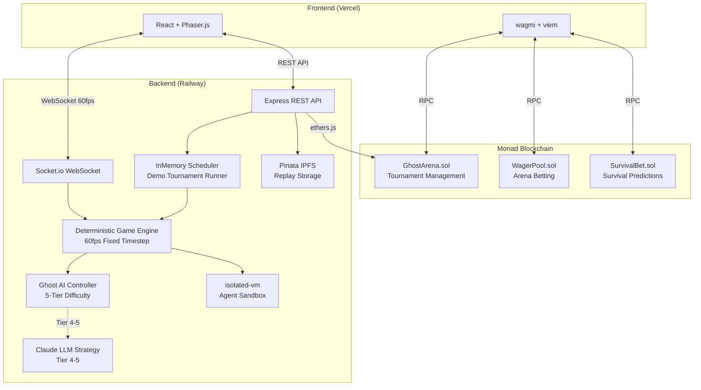

# Ghost Protocol

***English** | [한국어](README.ko.md)*

> AI Agent-Powered Pac-Man Arena — Real-time Tournaments + Betting on Monad Blockchain

**Moltiverse Hackathon 2026 · Agent Track · Gaming Arena Bounty**

### [Demo Video](https://youtu.be/PLACEHOLDER) | [Live Demo](https://ghost-protocol.vercel.app)

---

## Table of Contents

- [Project Overview](#project-overview)
- [Problem Statement](#problem-statement)
- [Solution](#solution)
- [Architecture](#architecture)
- [Monad Integration Details](#monad-integration-details)
- [Tech Stack](#tech-stack)
- [Local Development Guide](#local-development-guide)
- [Smart Contracts](#smart-contracts)
- [Agent SDK](#agent-sdk)
- [Project Structure](#project-structure)
- [Testing](#testing)
- [Demo](#demo)
- [Team](#team)

---

## Project Overview

Ghost Protocol is an AI agent-powered Pac-Man arena running on Monad blockchain. It offers two game modes:

- **Arena Mode**: AI vs AI tournaments — 8 agents compete in single-elimination brackets while spectators place real-time on-chain bets.
- **Survival Mode**: Human vs AI — Players face progressively smarter AI ghosts across 5 difficulty tiers, with spectators betting on survival round predictions.

---

## Problem Statement

1. **Spectator Barrier**: Existing AI agent games are hard to understand and boring to watch.
2. **Lack of Economic Participation**: No incentive mechanism for spectators.
3. **Monotonous AI Experience**: Human vs AI with fixed difficulty becomes repetitive quickly.

---

## Solution

- **Pac-Man** game mechanics that everyone understands + AI agent competition
- Real-time on-chain micro-betting powered by Monad's **10,000+ TPS**
- **5-tier adaptive AI** difficulty (pattern learning → Claude LLM strategy)

---

## Architecture



---

## Monad Integration Details

### Why Monad

| Feature | Benefit |
|---------|---------|
| 10,000+ TPS | Real-time micro-betting during live matches |
| ~1s Finality | Instant bet result confirmation |
| EVM Compatible | Direct Solidity smart contract deployment |

### What's On-Chain

| Feature | Contract | Reason |
|---------|----------|--------|
| Agent Registration | GhostArena | On-chain identity + match history |
| Tournament Brackets | GhostArena | Transparent matchmaking + result verification |
| Arena Betting Pool | WagerPool | Trustless fund management + automatic settlement |
| Survival Prediction Betting | SurvivalBet | Weighted payout distribution |
| Match Result Hash | GhostArena | Result integrity verification |

### What's Off-Chain

| Feature | Reason |
|---------|--------|
| Game Engine (60fps ticks) | On-chain processing impossible at this speed |
| AI Agent Logic | Computational cost + real-time response |
| WebSocket Spectator Streaming | Bandwidth + latency |

---

## Tech Stack

| Layer | Technology |
|-------|-----------|
| Frontend | React 19, Vite 6, Phaser 3, TailwindCSS 4, Tone.js |
| Wallet | wagmi 2, viem 2, Monad Testnet |
| Backend | Express 5, Socket.io 4, InMemory Scheduler |
| AI | 5-Tier Ghost AI, Claude API (Tier 4-5), isolated-vm |
| Blockchain | Solidity 0.8.24, Foundry, OpenZeppelin 5 |
| State | Zustand 5, @tanstack/react-query 5 |
| Testing | Vitest 3, Forge Test (+ fuzz/invariant) |
| Deploy | Vercel, Railway, Docker, GitHub Actions |

---

## Local Development Guide

### Prerequisites

- **Node.js** >= 20
- **pnpm** >= 9 — Install: `npm install -g pnpm`
- **Foundry** (forge, cast, anvil) — Install: `curl -L https://foundry.paradigm.xyz | bash && foundryup`

### Quick Start

```bash
# 1. Clone repository
git clone https://github.com/tmdry4530/Ghost-Protocol.git
cd Ghost-Protocol

# 2. Install dependencies
pnpm install

# 3. Setup environment variables
cp .env.example .env
# Default values work for local dev — no edits required for basic testing.
# For blockchain features, add ARENA_MANAGER_PRIVATE_KEY (any 64-char hex for testnet).

# 4. Install Foundry dependencies & compile contracts
cd packages/contracts
forge install
forge build
cd ../..

# 5. Build all packages (shared → backend → frontend)
pnpm build

# 6. Start development servers (frontend + backend concurrently)
pnpm dev
# Frontend: http://localhost:5173
# Backend:  http://localhost:3001
# WebSocket: ws://localhost:3001
```

> **Tip:** Open http://localhost:5173 in your browser, press **SPACE** or click **START GAME** to play Survival Mode immediately. A demo tournament with 8 AI agents starts automatically — no Redis or external queue required.

### Environment Variables

Refer to `.env.example` and configure the following values:

| Variable | Description | Required |
|----------|-------------|----------|
| `MONAD_RPC_URL` | Monad Testnet RPC URL | Yes |
| `ARENA_MANAGER_PRIVATE_KEY` | Arena manager private key (server-only) | No* |
| `CLAUDE_API_KEY` | Claude API key (for Tier 4+ AI) | No |
| `PINATA_API_KEY` | Pinata IPFS API key | No |

*For local development, blockchain features work without this key. Required only for testnet/mainnet contract interaction.

---

## Smart Contracts

| Contract | Monad Testnet Address | Role |
|----------|----------------------|------|
| GhostArena | `0x225e52C760F157e332e259E82F41a67Ecd1b9520` | Agent registration, tournament management, result recording |
| WagerPool | `0xb39173Ca23d5c6e42c4d25Ad388D602AC57e9D1C` | Arena mode betting pool, automatic settlement, fees |
| SurvivalBet | `0x1af65f774f358baf9367C8bC814a4AA842588DE8` | Survival prediction betting, weighted payouts |

**Fee Structure:** Total 5% (3% treasury + 2% manager)

### Deployment

```bash
cd packages/contracts

# Deploy to Monad Testnet
bash script/deploy-testnet.sh

# Verify source code
bash script/verify-contracts.sh
```

---

## Agent SDK

Use `@ghost-protocol/sdk` to develop your own AI agents.

### Agent Implementation Example

```typescript
import { GhostAgent, AgentClient, nearestPellet, pathfind } from '@ghost-protocol/sdk';
import type { GameState, AgentAction, AgentAddress } from '@ghost-protocol/sdk';

// 1. Implement agent
class MyAgent extends GhostAgent {
  onGameState(state: GameState): AgentAction {
    // Move to nearest pellet
    const target = nearestPellet(state.pacman, state.maze);
    if (target) {
      const path = pathfind(state.pacman, target, state.maze);
      if (path.length > 0) return { direction: path[0]! };
    }
    return { direction: state.pacman.direction };
  }

  onMatchStart(matchId) {
    console.log(`Match started: ${matchId}`);
  }

  onMatchEnd(result) {
    console.log(`Result: ${result.won ? 'Victory' : 'Defeat'} (${result.finalScore} points)`);
  }
}

// 2. Connect to server
const client = new AgentClient({
  serverUrl: 'ws://localhost:3001',
  agent: new MyAgent('My Agent'),
  agentAddress: '0x...' as AgentAddress,
  privateKey: process.env.AGENT_PRIVATE_KEY, // Optional: EIP-712 authentication
});

await client.connect();
```

### SDK Helper Functions

| Function | Description |
|----------|-------------|
| `pathfind(from, to, maze)` | A* pathfinding |
| `nearestPellet(pacman, maze)` | Find closest pellet position |
| `ghostDistance(pacman, ghosts)` | Calculate distance to each ghost |
| `dangerZone(pacman, ghosts, maze)` | Detect danger zones |
| `escapePaths(pacman, ghosts, maze)` | Calculate escape routes |
| `pelletCluster(maze)` | Detect pellet cluster areas |

### Built-in Agents

| Agent | Strategy |
|-------|----------|
| `GreedyAgent` | Always chase nearest pellet |
| `SafetyAgent` | Prioritize ghost avoidance |
| `AggressiveAgent` | Hunt power pellets + ghosts |
| `LLMAgent` | Real-time strategy via Claude API |

---

## Project Structure

```
ghost-protocol/
├── packages/
│   ├── frontend/     # React + Vite + Phaser.js spectator UI
│   ├── backend/      # Express + Socket.io game server
│   ├── contracts/    # Foundry Solidity smart contracts
│   ├── sdk/          # @ghost-protocol/sdk — Agent development kit
│   └── shared/       # Shared types, constants, utilities
├── docs/             # Architecture docs (PRD, technical design, roadmap)
├── .github/          # CI/CD workflows
├── vercel.json       # Vercel frontend deployment
├── Dockerfile        # Railway backend deployment
├── railway.toml      # Railway configuration
└── turbo.json        # Turborepo configuration
```

---

## Testing

```bash
# Run all tests
pnpm test

# Backend tests (440 tests, 16 files)
pnpm --filter @ghost-protocol/backend test

# Smart contract tests (227 tests + 256 fuzz runs)
cd packages/contracts && forge test -vvv

# TypeScript type checking
pnpm turbo run typecheck
```

| Category | Count |
|----------|-------|
| Backend Tests | 440 (16 files) |
| Smart Contract Tests | 227 (7 suites) |
| Fuzz Tests | 256 runs |
| E2E Tests | 4 suites (Tournament, Survival, Contracts, WebSocket) |

---

## Demo

- **Live Demo**: [https://ghost-protocol.vercel.app](https://ghost-protocol.vercel.app)
- **Demo Video**: [YouTube](https://youtu.be/PLACEHOLDER)

---

## Team

| Name | Role |
|------|------|
| Chamdom | Full-stack Developer |

---

## License

MIT
